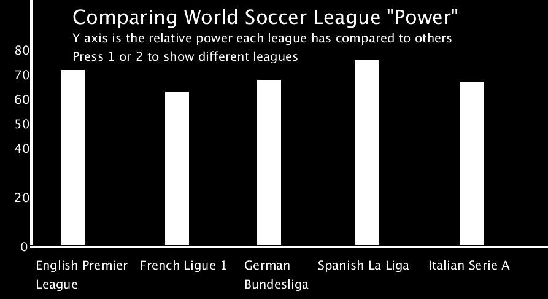
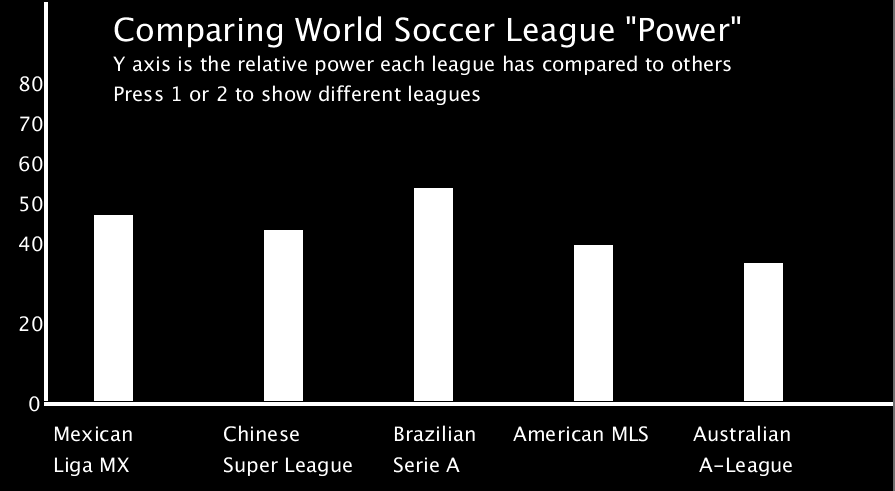

# Anthony Tabura's csPortfolio


 <details>
 <summary>Soccer Power Index Data Visualization</summary>
 <h3>Links:</h3>
	<UL>
	<details>
	<LI>  <summary>Visualization Images</summary>
	    <p>
  

	</p>
	</details>
<LI>  <a href="https://github.com/TaburaA/starfield5">Project Code<br></a>
	</UL>
<BLOCKQUOTE>
For this lab we were to focus on inheritance and interfaces. My lab used triginometry, PImage and randomization to create the image of turkeys flying in random increments in a circle, along with a giant corn and pilgrim hats. Since Thanksgiving was around the corner, this lab was Thanksgiving themed. The turkeys had their own code, and by using inheritence and interfaces, the other two images were able to follow the same code without any additional work. I learnt a lot about inheritence and interfaces, much more than last year.
	</BLOCKQUOTE>

</p>
 </details>

<details>
 <summary>More Reflections</summary>
 <p>
  
 1. Individual Lab Reflections are under their respective dropdown menus.
 
 </p>
 <p>
	
  2. The thing I'm most proud of in my CS development is my ability to make my code my own. Throughout the labs and projects, we had checklists to fill, and deadlines to meet, yet I always went above and beyond to implement things that made it unique to me. Whether it would be to use PImages, sound bytes, or increased interactiveibility, I always enriched my education by going further than the call of duty. 
  
  </p>
  
  <p>
	
 3. Here's an examle as a code snippet:
 
 </p>
 
   ```Java
  text("Get 350 or more to win!",20,450);
  
  
 text("Total:", 20,550);
 
 
  text(total,120,550); 
  
  
   if(total>350){
   
   
    textSize(32);
    
    
    fill(255);
    
    
    text("YOU WIN!",200,550);
    
    
    image(img,210,150);
    
    
   }
   
  total=0;
  
 ```
 <p>
	
 While this is an early example, I still made it my own. Instead of just having a You Win message, I learnt how to use Images in processing and put in an image of Dr. R. 
 
 </p>
 
 <p>
	
 4. The most difficult piece of code would be the use of javascript to combine images, sound, and keyPressed() to make an interactive project!
 
 </p>
 <p>
	
 5. Here's the code:</p>
```Java
 function preload() {
	one = loadSound("data/straightup.wav");
	two = loadSound("data/skrt.wav");
	three = loadSound("data/itslit.mp3");
	img = loadImage("data/scott.png");
}


if (key == '1') {
		sike = 1;
		adlib = 0;
		while (adlib < 1) {
			one.play();
			adlib = 1;
		}
 
  
  	move(sike) {
		//var oliver = atan((mouseY - y) / (mouseX - x));
		var oliver = Math.PI * 2;
		if (sike == 1) {
			this.x += random(-5, 5);
			this.y += random(-5, 5);
			if (mouseX < this.x) {
				this.x -= cos(oliver) * 1;
				this.y -= sin(oliver) * 1;
			} else {
				this.x += cos(oliver) * 1;
				this.y += sin(oliver) * 1;
			}
		}

```
<p>
	
6. This code was challenging because I wanted to use the sound library of processing, but I coudln't because it wasn't available on github. I also wanted the objects I created to go straight to the mouse, but it the object would always go in zig zag fashion. In order to fix this, the code was converted to java script. It used function preload() along with loadsound() and loadimage() to load the files into the program. Then, I found out how to use keyPressed() to emit images and sound in an efficient way. To make the objects move in a straight line, I used trigonometry to create a line that went along either the cos or the sin of the angle. This would create a straight line from the orgin to the mouse. 

 </p>
 </details>
<details>
 <summary>TransitTree Final Project(Not 100% Working-Look in "details"!)</summary>
 <h3>Links:</h3>
    <p>
  
  <a href="https://taburaa.github.io/TransitTree/">Transit Tree<br></a>
  
  <a href="https://github.com/TaburaA/TransitTree">Repo URL<br></a>
 <details>
    <summary>Transit Tree Details</summary>
 <p>
Using a tree, people answer binary questions to find out what transportation they should use to get to their destination. The GH webpage won't work because the RIGHT key won't function, but it's fully functioning in processing.
</p>
    </details>

</p>
 </details>
